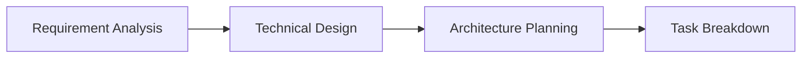
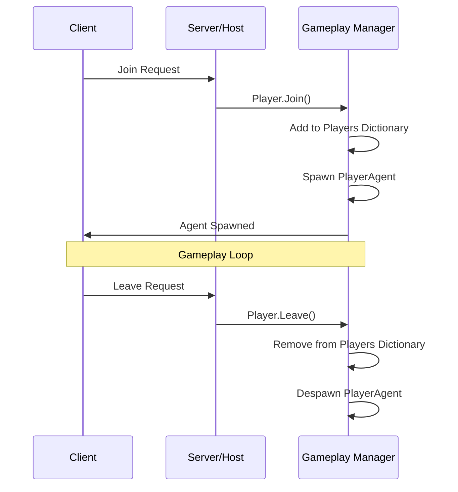

# Unity Multiplayer Game Project Workflow & Architecture

## 🎮 Tổng Quan Dự Án
Dự án **Game_Multi_DauTien** là một game multiplayer được phát triển bằng Unity 3D và sử dụng Photon Fusion framework cho networking.

## 🏗️ Kiến Trúc Dự Án

### 1. Cấu Trúc Thư Mục Chính
```
Game_Multi_DauTien/
├── Assets/
│   ├── Scripts/           # Source code chính
│   ├── Prefabs/          # GameObject prefabs
│   ├── Scenes/           # Game scenes
│   ├── Materials/        # Materials và textures
│   ├── Animations/       # Animation clips và controllers
│   ├── Audio/           # Audio clips
│   ├── Photon/          # Photon Fusion assets
│   └── Settings/        # Project settings
├── ProjectSettings/      # Unity project configurations
├── Packages/            # Package dependencies
└── Builds/             # Built executables
```

### 2. Kiến Trúc Networking (Photon Fusion)

#### Core Components
- **NetworkRunner**: Quản lý network session và tick simulation
- **NetworkObject**: Đối tượng có thể được đồng bộ qua mạng
- **NetworkBehaviour**: Base class cho các component networking
- **NetworkDictionary**: Lưu trữ dữ liệu player theo PlayerRef

#### Gameplay Architecture
```
Gameplay (NetworkBehaviour)
├── Players (NetworkDictionary<PlayerRef, Player>)
├── SpawnPoints Management
├── Player Join/Leave Logic
└── Agent Spawning/Despawning
```

## 🔄 Workflow Phát Triển

### 1. Phase Setup & Planning


### 2. Development Workflow

#### Daily Development Flow
1. **Morning Standup** (15 phút)
   - Review progress từ ngày hôm trước
   - Identify blockers và dependencies
   - Plan tasks cho ngày hôm nay

2. **Development Sprint** (4-6 tiếng)
   - Code implementation
   - Unit testing
   - Local testing với multiple clients

3. **Integration & Testing** (1-2 tiếng)
   - Merge code với main branch
   - Network testing
   - Performance profiling

### 3. Git Workflow
```
main branch (production)
├── develop (integration)
├── feature/player-movement
├── feature/weapon-system
├── bugfix/networking-sync
└── hotfix/critical-issue
```

#### Branch Strategy
- **main**: Production-ready code
- **develop**: Integration branch for features
- **feature/***: Tính năng mới
- **bugfix/***: Sửa lỗi không critical
- **hotfix/***: Sửa lỗi critical cần deploy ngay

### 4. Testing Workflow

#### Local Testing
1. **Single Player Testing**
   - Gameplay mechanics
   - UI/UX functionality
   - Performance baseline

2. **Multiplayer Testing**
   - Host + Client trên cùng máy
   - LAN testing với multiple devices
   - Latency simulation

#### Network Testing Checklist
- [ ] Player join/leave
- [ ] Spawn/despawn synchronization  
- [ ] Health system networking
- [ ] Input prediction và lag compensation
- [ ] Connection timeout handling

### 5. Build & Deployment

#### Build Process
1. **Development Builds**
   - Daily builds cho internal testing
   - Debug symbols enabled
   - Logging enabled

2. **Release Builds**
   - Optimized performance
   - Minimal logging
   - Release configuration

#### Platform Targets
- **PC (Windows)**: Primary platform
- **Future**: Mobile, Console expansion

## 🎯 Gameplay Flow

### 1. Game Session Lifecycle
```
Session Start → Player Join → Agent Spawn → Gameplay Loop → Player Leave → Session End
```

### 2. Player Management Flow


### 3. Respawn System
- **Death Detection**: Health.FatalHitTaken event
- **Respawn Delay**: 3 seconds (configurable)
- **Spawn Protection**: 3 seconds immortality after respawn
- **Spawn Point Rotation**: Round-robin spawn point selection

## 🛠️ Development Tools & Setup

### Unity Version & Packages
- **Unity**: 2022.3 LTS hoặc mới hơn
- **Photon Fusion**: Latest stable version
- **Input System**: New Unity Input System
- **Universal Render Pipeline**: For enhanced graphics

### Development Environment
1. **IDE**: Visual Studio 2022 / JetBrains Rider
2. **Version Control**: Git với GitKraken
3. **Testing**: Unity Test Framework
4. **Profiling**: Unity Profiler, Fusion Statistics

### Performance Considerations
- **Tick Rate**: 60 ticks per second
- **Network Object Limit**: 200 concurrent players
- **Memory Management**: Object pooling cho projectiles
- **Bandwidth Optimization**: Delta compression, interest management

## 📊 Monitoring & Analytics

### Performance Metrics
- **Network RTT**: Round-trip time
- **Packet Loss**: Network reliability
- **Simulation Time**: Server performance
- **Frame Rate**: Client performance

### Debug Tools
- **Fusion Debugger**: Real-time network state
- **Unity Console**: Error logging
- **Custom Debug UI**: In-game performance overlay

## 🔮 Future Enhancements

### Planned Features
- [ ] Matchmaking system
- [ ] Player progression & stats
- [ ] Multiple game modes
- [ ] Mobile platform support
- [ ] Spectator mode

### Technical Improvements
- [ ] Server browser implementation
- [ ] Anti-cheat integration
- [ ] Cloud save system
- [ ] Analytics integration